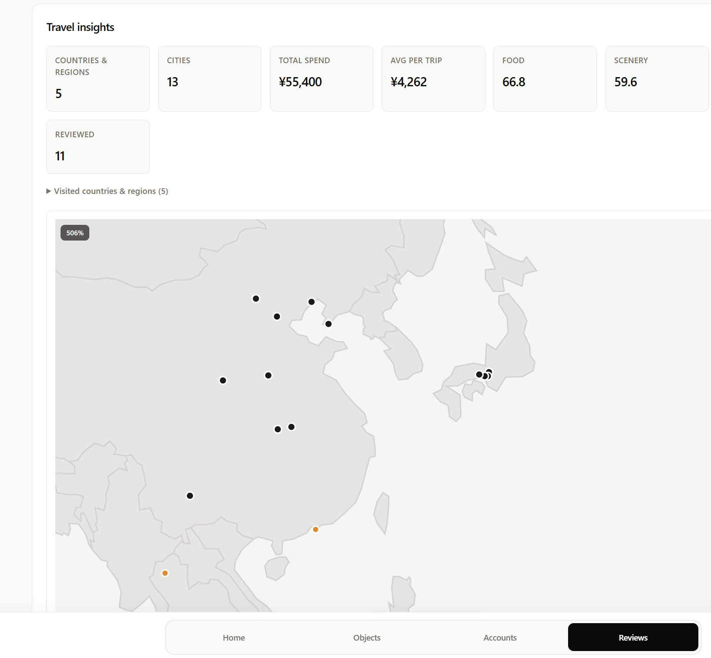
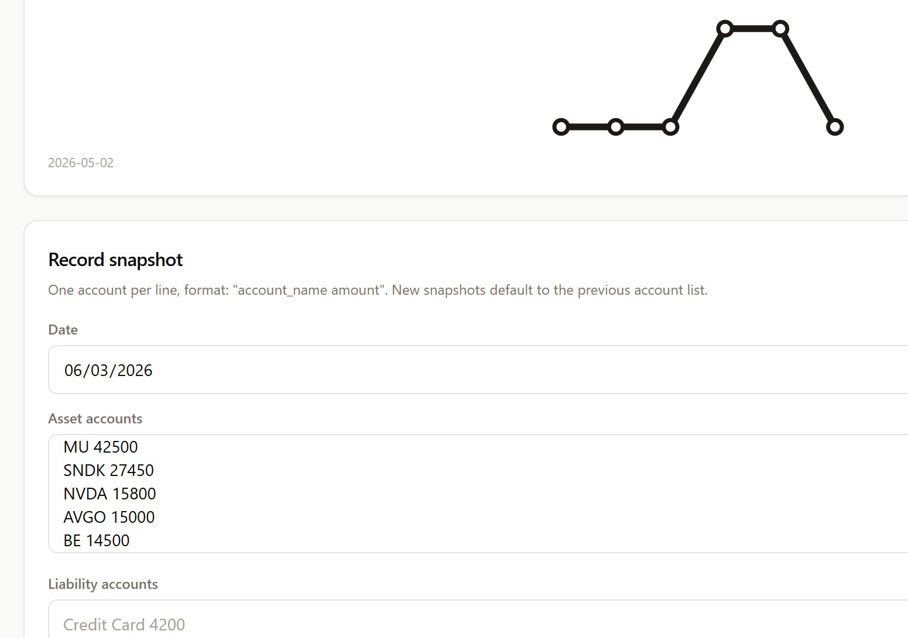

# Ownly

> **Own less, Live more, Decide better.**

[](https://obsidian.md/plugins?id=ownly)
[](LICENSE)
[](https://ko-fi.com/F1F7WYJ6B)

**A local-first ownership memory and decision ledger — inside your vault.**

Ownly records what you own, what it costs, how you used it, and what you learned.
Everything is stored as **plain Markdown with YAML frontmatter** in a folder you
choose — no account, no cloud, no lock-in.



## Why Ownly

- **Your vault is the database** — records are Markdown you can open, edit, search, and back up with your own tools.
- **Decision-led** — observe → acquire or pass → use → exit → review. Ownly keeps the whole story, not just a list.
- **Recoverable** — archive and restore are distinct from permanent delete.
- **One data model** — the same records work across Obsidian, the Web/PWA app, the Agent CLI, and the local MCP server.

## What you can track

| Record | Purpose |
| --- | --- |
| Physical item | Purchase, use, cost, condition, retirement, transfer, or discard |
| Recurring cost | Subscriptions and repeating bills, with billing cycle and annualized cost |
| One-time experience | Plan, budget, actual cost, location, completion, and review |
| Snapshot | Point-in-time net worth and account balances |
| Review | Structured post-use, monthly, or annual reflection |
| Object experience log | Append-only usage, issue, maintenance, regret, lesson, or exit notes |

## Travel planner

Plan a whole trip inside Obsidian:

- Capture places from Google Maps with the companion **Ownly Capture** browser extension, or add them by hand.
- Build a candidate pool, then schedule stops into a day-by-day timeline.
- See the route on a map, compare hotels, track a budget and ledger, and split expenses.
- Export a trip to Markdown, CSV, KML, or a calendar (`.ics`).

## Insights (Pro)

- **Travel insights** — countries and cities visited, spend, and review scores on a world map.
- **Object insights** — annualized subscription cost per currency, a net-worth trend, and "unused for X days" reminders.
- **Calendar feed** — a continuously updating subscription URL for your trips.



## Install

### From the community plugins directory

1. Open **Settings → Community plugins → Browse**.
2. Search for **Ownly**.
3. Select **Install**, then **Enable**.

### Manual install

1. Download `main.js`, `manifest.json`, and `styles.css` from the [latest release](https://github.com/liuh886/ownly-obsidian/releases).
2. Place them in `<Your Vault>/.obsidian/plugins/ownly/`.
3. Enable **Ownly** in **Settings → Community plugins**.

> Requires Obsidian 1.8.7 or later.

## Where your data lives

On first use, choose where the **Ownly data folder** lives — a normal local folder,
or a folder already synchronized by a provider you control (Dropbox, Google Drive,
OneDrive, iCloud Drive…). Ownly reads and writes that folder directly; it does not
use provider APIs and does not host your data.

```text
Ownly/
  Objects/  Accounts/  Snapshots/  Reviews/
  Trips/  Trip Places/  Trip Visits/  Trip Legs/  Trip Expenses/
  Logs/Object Experiences/  Archive/
```

## Privacy

Ownly is local-first: it does not host your ledger, require an account, or upload
your Markdown. See the [privacy policy](https://liuh886.github.io/ownly/privacy).

## Links

- Product page — https://liuh886.github.io/ownly/
- Web app / PWA — https://liuh886.github.io/ownly/app/
- Documentation — https://github.com/liuh886/ownly/tree/main/docs
- Changelog — [CHANGELOG.md](CHANGELOG.md)
- Report an issue — https://github.com/liuh886/ownly/issues
- Support Ownly — https://ko-fi.com/F1F7WYJ6B

## Development

This repository is generated from the Ownly monorepo (https://github.com/liuh886/ownly)
and contains only the plugin and the source it depends on. Do not edit it by hand —
changes are overwritten on the next release sync.

```sh
npm install
npm run build     # produces main.js and styles.css
npm run validate  # build + release validation
```

## License

MIT. See [LICENSE](LICENSE).
